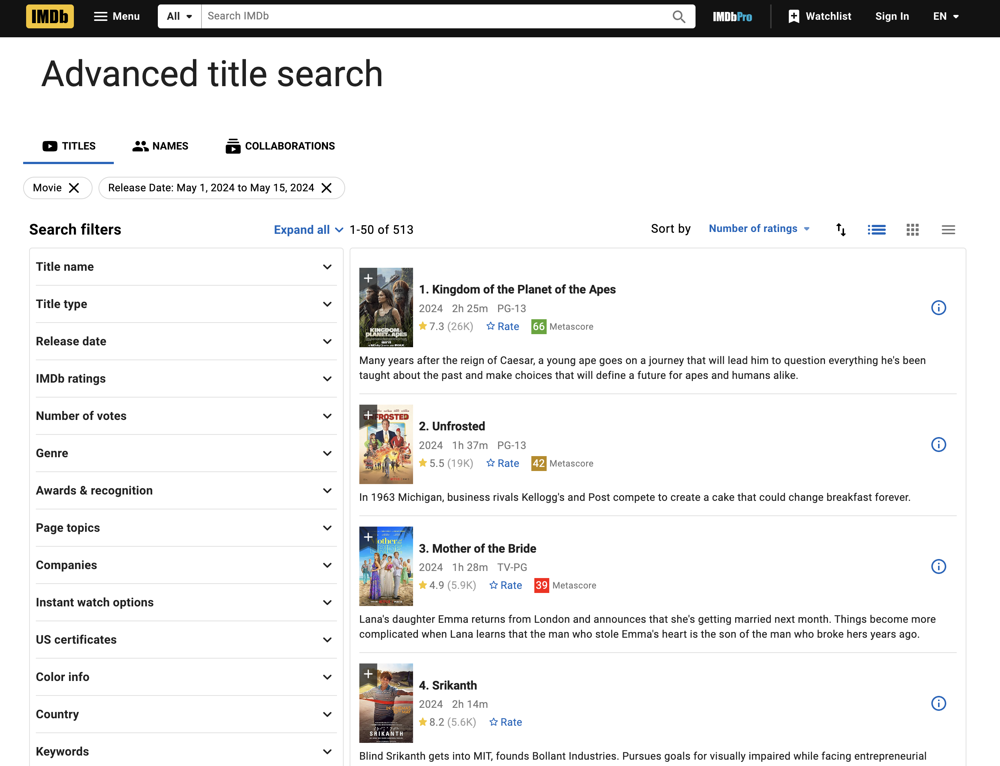

# Web Scraping IMDB (2024)


This Python project scrapes movie data from IMDb for feature films released between May 1, 2024, and May 15, 2024 (You can change the date based on the filtering on the webpage). It collects data such as IMDB IDs, movie names, links ofnthe movies, release years, durations, IMDb ratings, vote counts, Metascores, and summaries, and compiles them into a structured format.

This script will:
* Open a Chrome browser window.
* Navigate to the IMDb page with the specified search criteria.
* Scrape the movie data.
* Save the data into a pandas DataFrame.

The script will automatically click through the pages of the IMDb search results, collecting movie data until no more pages are available.

# Script Details

## WebDriver Setup
The script uses Selenium WebDriver to interact with the IMDb website. The `ChromeDriver` is managed automatically using the `webdriver_manager` package.

## Parsing Movies
A `parse_movie` function is used to extract the necessary details from each movie's HTML tag.

## Scraping
The `scrape_current_page` function converts the current page source into a BeautifulSoup object and extracts movie data. The script continues to click the "50 more" button to load additional movies until no more pages are available.

## Data Collection
Collected movie data includes:
* IMDB ID
* Movie Name
* IMDB Link
* Year of Release
* Duration
* Rating
* IMDb Rating
* Votes
* Metascore
* Summary

## Stopping Condition
The script stops scraping when there are no more pages to load. An exception is caught, and a message "No more pages to scrape." is printed.

## Duplicate Handling
The script ensures that movies with the same name but different IMDb IDs are treated as distinct entries by checking both the movie name and IMDb ID.
```
https://www.imdb.com/title/tt11389872/?ref_=sr_t_1
```

## Saving the Data
You can modify the script to save the collected data to a CSV file or any other preferred format using pandas.

## Notes
* Ensure that the Chrome browser is up-to-date for compatibility with the ChromeDriver.
* Modify the URL or other parameters in the script to scrape different time periods or types of content from IMDb.

# License
This project is licensed under the MIT License - see the LICENSE file for details.

Feel free to open issues or pull requests for improvements and bug fixes. Happy scraping!
